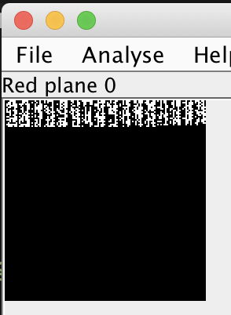

# Truly Blue?
45 points

## Challenge 
> I love lots of things about my school, [Phillips Academy Andover](https://www.andover.edu). But most of all, I love its school color: a soothing shade of blue. I couldn’t just tell you the hex code for the color; that wouldn’t be enough! I think a 128 x 128 PNG file is probably a better method of conveying its utter beauty. That’s not suspicious, right? Gaze upon its beauty! [True blue!](true-blue.08c0cb787f26.png)

## Hint
> Did you know there are 16,777,216 possible RGB colors, and only one of them is Andover blue? I wonder if you could even tell the difference between all of them…

## Solution

Open in StegSolve and we see some bits in the LSB of the red, blue and green panes.

Parse it in python and retrieve LSB of RGB and concat it together.

	$ python3 solve.py 
	Lorem ipsum dolor sit amet, consectetur adipiscing elit. Ut eleifend, metus accumsan accumsanpharetra, dui justo lobortis augue, non bibendum sapien lacus a nulla. Praesent non libero et magnaornare interdum. Vivamus et mi et justo tincidunt porttitor placerat in nisl. Nam mollis quam sitamet iaculis volutpat. Nulla posuere pulvinar est, ac consectetur ex rhoncus non. Vivamus efficitur,ex vel lobortis faucibus, massa neque iaculis libero, eu dictum orci odio ut ante. Phasellus luctusmagna vel euismod cursus. Donec et est rhoncus, lacinia metus in, sodales lectus. Sed posuere, nibhvitae egestas rutrum, nisl odio iaculis urna, et bibendum dolor augue tristique lacus. Ut nuncmetus, blandit a nisl vitae, pulvinar fringilla justo. The flag is "last bitsmatter". Congratulations! You cracked the code! I$I$I$I$I$I$I$I$I$I$I$I$I$I$I$I$I$I$I$I$I$I$I$I$I$I$I$I$I$I$I$I$I$I$I$I$I$I$I$I$I$I$I$I$I$I$I$I$I$I$I$I$I$I$I$I$I$I$I$I$I$I$I$I$I$I$I$

## Flag

Somehow, a space must be added for the accepted flag

	last bits matter