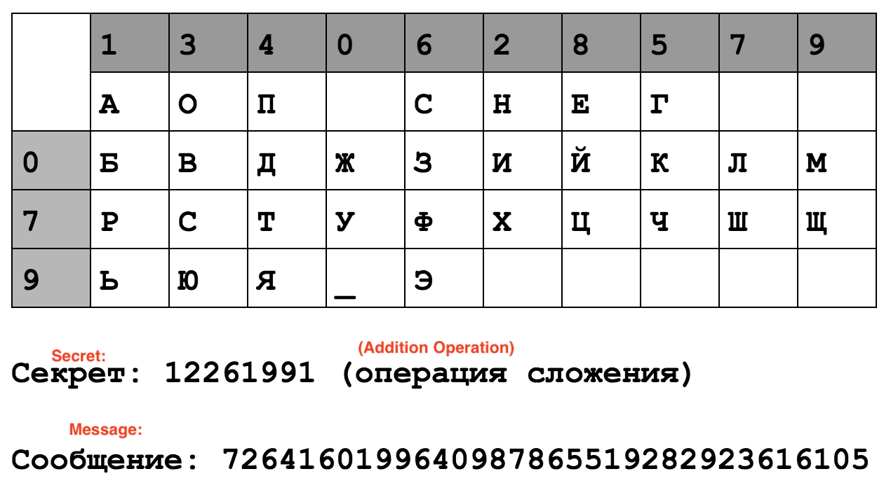

# Victor
50 points

## Challenge 
> Привет, меня зовут Рейно, иначе известный как Виктор. Пожалуйста, расшифруйте это секретное сообщение - у меня нет времени для этого. Я предоставляю вам ключ.

> Note: the flag contains Cyrillic characters.

> [необходимая информация](key.490c9f36a766.png)

## Hint
> Google Translate is your friend—but you might want to familiarize yourself with Russian Nihilism, too.

## Solution

### Google Translate

Translate the challenge description

> Hello, my name is Reynaud, otherwise known as Victor. Please, decipher this secret message - I do not have time for this. I give you the key.

> [necessary information](key.490c9f36a766.png)

Translate the image

Transcribe to text (used handwriting software on my phone)

	   1340628579
	-: АОП СНЕГ  
	0: БВДЖЗИЙКЛМ
	7: РСТУФХЦЧШЩ
	9: ЬЮЯ_Э

	SECRET: 12261991 (Addition Operation)
	MESSAGE: 7264160199640987865519282923616105

### VIC cipher
Search for victor and we find the [Russian VIC cipher](https://en.wikipedia.org/wiki/VIC_cipher)

References
- http://practicalcryptography.com/ciphers/straddle-checkerboard-cipher/
- http://www.crypto-it.net/eng/simple/vic.html?tab=1
- https://rijmenants.blogspot.sg/2005/08/russian-vic-cipher.html

Now we understand it:

The secret is applied to the actual message using the addition operation without carry-over. The secret is repeated until the length of the message

Do in reverse to get the actual message.

	  7264160199640987865519282923616105
	- 1226199112261991122619911226199112
	= 6048071087489096743900371707527093

Finally, go through the straddle checkerboard cipher to get the plaintext.

### Solver script
Now, I made a script to convert the message back to the original text.

I also made it do a lookup table for the straddle checkerboard cipher.

Running it, we get the output

	$ python3 solve.py 
	СДЕЛАЙТЕ_ЭТО_ВРУЧНУЮ

Unfortunately, it is not accepted. However, changing to lowercase works!

	>>> 'СДЕЛАЙТЕ_ЭТО_ВРУЧНУЮ'.lower()
	'сделайте_это_вручную'

## Flag

	сделайте_это_вручную