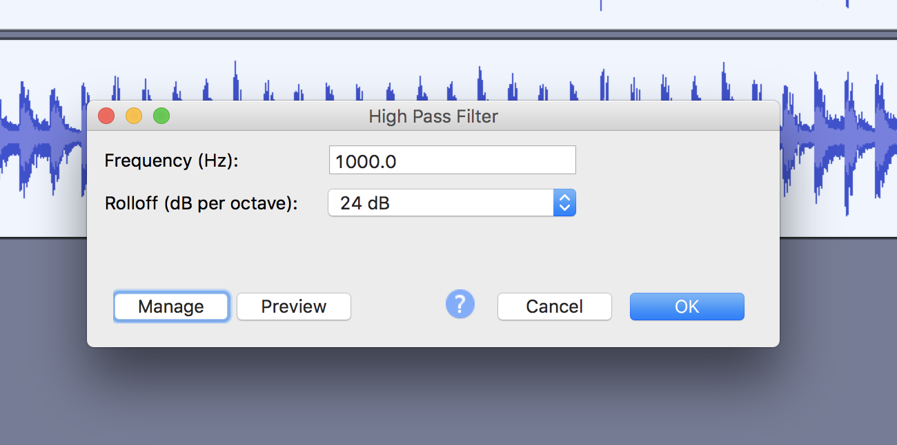
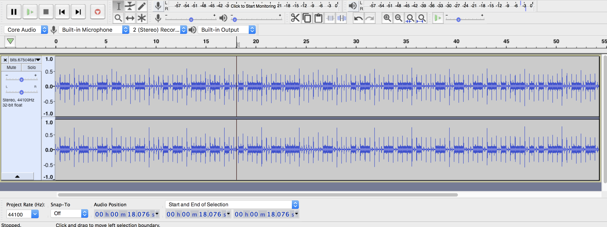

# Beats by Dr. K
55 points

## Challenge 
> Dr. K just released her new EP — download her [track](bits.675c46a10049.wav) now!

## Hint
> Listen to each bit…

## Solution

Open in audacity.

Notice that at each background beat, there is either a foreground sound or no foreground sound which are of higher frequencies.

Knowing this, we cann filter out the lower frequencies.

> High Pass Filter of 1000Hz with rolloff of 24dB
> 

(Saved as `bits-filtered.wav` as a mono track)

This leaves us with a binary-looking signal

> 

Convert it to numbers. (I manually did it because I didn't know how to code a converter quickly)

	0110|01100110|11000110|00010110|01110110|10010111|00110111|00000110|00010110|00110111|01000110|01100110|11010111|01010111|00110110|10010110|0011

Convert [binary to ASCII](https://www.rapidtables.com/convert/number/binary-to-ascii.html)

	flagispactfmusic

## Flag

	pactfmusic

---

### Script

For completeness, I decided to make a script after solving it. 
It's similar to "Ears to the rescue" in Pragyan CTF 2018

I saved `bits-filtered.wav` as a mono track to simplify the script.

It takes a 16-bit audio sample and then gets the amplitude for it.

There are separators every 0.469 sec (must be exact or the errors will add up and the flag becomes distorted towards the end).

Hence, we can average out all the amplitude values every 0.469 sec to get the binary bits.

	$ python3 solve.py 
	Audio Information
	> Length: 2646000
	> Frequency: 44100
	Extracting WAV data
	> Done all5999
	Averaging amplitude values
	> Interval: 20682
	> Threshold: 900
	> ...
	flagispactfmusic
